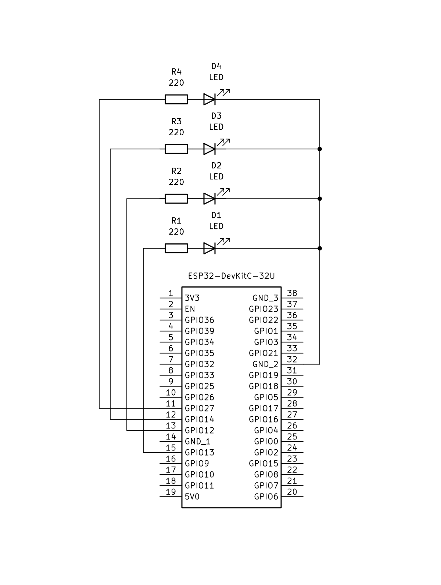

# ESP32-FINGERS-LED

Hand-tracking finger counter that lights up LEDs on an ESP32 board depending on which fingers are bent. Finger detection is done on a PC using **OpenCV** + **MediaPipe**, and the result is sent to the **ESP32** (flashed with **PlatformIO**) to drive individual LEDs — one per finger: **index, middle, ring, pinky**. Bending several fingers at once works too — each LED is controlled independently.

## How it works

1. `python_app` captures your webcam feed, uses MediaPipe Hands to detect hand landmarks, and determines which fingers are bent.
2. The result is sent to the ESP32 board running the `esp32_firmware` sketch.
3. The ESP32 turns the matching LED(s) on or off in real time.

## Hardware

- Any ESP32 dev board (project was built and tested on a **DOIT ESP32 DEVKIT V1**). If you use a different board, just change the `board` field in `esp32_firmware/platformio.ini`.
- 4x LED
- 4x 220 Ω resistor
- Breadboard + jumper wires

### Pinout

| Finger | LED | ESP32 pin |
|---|---|---|
| Index  | D1 | GPIO13 |
| Middle | D2 | GPIO12 |
| Ring   | D3 | GPIO14 |
| Pinky  | D4 | GPIO27 |

Each LED is wired with its own 220 Ω current-limiting resistor between the GPIO pin and the LED anode; all LED cathodes share a common GND.



## Requirements

- **Python 3.11.x** (required — the MediaPipe version used here doesn't support newer Python versions)
- **PlatformIO** (as a CLI, or the VS Code extension) to build and flash the firmware
- A webcam
- An ESP32 board connected via USB

## Project structure

```
ESP32-FINGERS-LED/
├── assets/
│   └── schema.png          # circuit schematic
├── esp32_firmware/         # PlatformIO project (ESP32 firmware)
│   ├── src/
│   │   └── main.cpp
│   └── platformio.ini
├── python_app/              # PC-side hand tracking app
│   ├── src/
│   │   └── main.py
│   └── requirements.txt
├── LICENSE
└── README.md
```

## Getting started

### 1. Clone the repository

```bash
git clone https://github.com/subarash-ii/ESP32-FINGERS-LED.git
cd ESP32-FINGERS-LED
```

### 2. Flash the ESP32 firmware

1. Install [PlatformIO](https://platformio.org/install) (CLI or the [VS Code extension](https://platformio.org/install/ide?install=vscode)).
2. Open the `esp32_firmware` folder as a PlatformIO project.
3. If you're not using a DOIT ESP32 DEVKIT V1, edit the `board` value in `esp32_firmware/platformio.ini` to match your board.
4. Connect the ESP32 via USB and build & upload:

```bash
cd esp32_firmware
pio run --target upload
```

5. Wire up the LEDs and resistors according to the [pinout table](#pinout) / [schematic](assets/schema.png).

### 3. Run the Python application

1. Make sure Python **3.11** is installed:

```bash
python3.11 --version
```

2. Create and activate a virtual environment:

```bash
cd python_app
python3.11 -m venv venv

# Windows
venv\Scripts\activate

# macOS / Linux
source venv/bin/activate
```

3. Install the dependencies:

```bash
pip install -r requirements.txt
```

4. Run the app:

```bash
python src/main.py
```

5. Point your webcam at your hand and start bending fingers — the corresponding LEDs on the ESP32 should light up.

## License

This project is licensed under the terms of the [LICENSE](LICENSE) file included in this repository.
